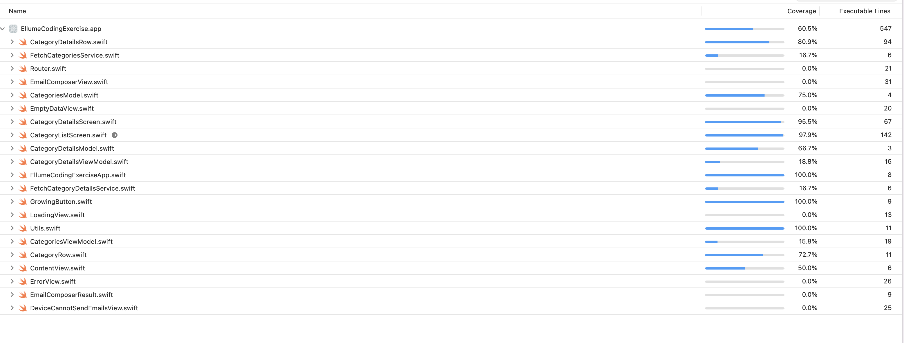

# Ellume Coding Exercise

## SwiftUI-MVVM
A project that uses SwiftUI and swift 5.5, MVVM for software architecture.

## Compatibility
- Xcode 13.2
- iOS 15 and later
- SwiftUI 3
- Swift 5.5

## Project overview
 - Use the They Said So API (https://theysaidso.com/api/
Quotes API from They Said So
The They Said So website holds an extensive database with over a million quotes from a hundred thousand different authors. Developers can access all these quotes through the API, which also categorizes the quotes to find them easier.
theysaidso.com) to randomly select a category from those available and retrieve the quote of the day for that category then:

        a. Set the email subject to the quote title
        b. Set the message body to the quote and author

- The user can specify a list of recipients.

- When the user taps the Send button, the email is sent to the recipients.

## Screens 
 

## What you can find in this project
 ### Home screen :
- Categories sorted by alphabetical order.

 ### Second screen :
- quote title
- Quote
- Author Name

 ### Unit test : 
- functional testing covered

- Automation UI testing - Not covered

## Project Folder structure

## License
Copyright tdmihiran@gmail.com,  Licensed under the MIT license.
